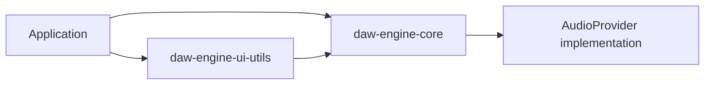

# DAW Engine

DAW Engine is a collection of TypeScript packages for building a Digital Audio Workstation (DAW).

`@anaidev/daw-engine-core` manages domain state and audio control. `@anaidev/daw-engine-ui-utils` provides
timeline, waveform, and Canvas rendering utilities. The packages do not include UI framework components.

## Packages

| Package                                      | Purpose                                              | Main APIs                                                                         |
| -------------------------------------------- | ---------------------------------------------------- | --------------------------------------------------------------------------------- |
| [`@anaidev/daw-engine-core`](./core)         | Session state and audio control                      | `Session`, `Track`, `Region`, `AudioEngine`, `CommandExecutor`, `Signal`          |
| [`@anaidev/daw-engine-ui-utils`](./ui-utils) | Calculations and Canvas utilities for DAW interfaces | `TimelineViewport`, `TrackLayout`, `computePeaks`, `renderWaveform`, `SceneGraph` |

`ui-utils` depends on `core`. Install only `core` if your application does not need the UI utilities.



## Requirements

- Node.js 18 or later
- A runtime or bundler that supports ECMAScript Modules (ESM)
- An `AudioProvider` implementation for audio playback and recording
- The relevant Web APIs when using Canvas rendering, `AudioBuffer`, `requestAnimationFrame`, or IndexedDB features

## Installation

Install the session and audio engine package:

```bash
npm install @anaidev/daw-engine-core
```

Install both packages when building a timeline or waveform interface:

```bash
npm install @anaidev/daw-engine-core @anaidev/daw-engine-ui-utils
```

## Step-by-Step Guide

### 1. Create a Session

`Session` manages DAW project state such as tracks, regions, and tempo. This example does not play audio, so it
does not require an `AudioProvider`.

```typescript
import { Session, TrackType } from '@anaidev/daw-engine-core';

const session = new Session('My Song', undefined, 48_000);

const trackAddedSubscription = session.trackAdded.connect((track) => {
  console.log(`Track added: ${track.name}`);
});

const vocalTrack = session.addTrack('Vocal', TrackType.AUDIO);
vocalTrack.setArmed(true);
session.setTempo(120);

const snapshot = session.toJSON();
const restoredSession = Session.fromJSON(snapshot);

console.log(restoredSession.name);
trackAddedSubscription.dispose();
```

### 2. Calculate Timeline Coordinates and Waveform Data

`TimelineViewport` converts between audio frames and screen pixels. `computePeaksFromSamples` converts PCM samples
into minimum, maximum, and root mean square (RMS) values for waveform rendering.

```typescript
import {
  TimelineViewport,
  computePeaksFromSamples,
} from '@anaidev/daw-engine-ui-utils';

const viewport = new TimelineViewport(48_000);
viewport.setDuration(180);
viewport.setViewportWidth(1_200);
viewport.setPixelsPerSecond(100);

const oneSecondX = viewport.frameToPixel(48_000);
console.log(oneSecondX); // 100

const samples = new Float32Array([0, 0.25, 0.5, -0.5, -0.25, 0]);
const peaks = computePeaksFromSamples(samples, 2);

console.log(peaks.length); // 3
```

### 3. Connect Audio Input and Output

`AudioEngine` requires an `AudioProvider` implementation when it is first initialized. The implementation must
satisfy the [`AudioProvider`](./core/src/audio/AudioProvider.ts) interface for transport, track creation, region
scheduling, metering, and related audio operations.

This repository does not include a Web Audio or native audio backend implementation.

## Features

### Core

- Domain models for sessions, tracks, regions, sources, markers, and ranges
- Command execution with undo and redo history
- Audio backend integration through the `AudioProvider` interface
- Models for automation, MIDI, routing, processors, and plugins
- State change notifications through `Signal<T>`
- Session snapshot creation and restoration

### UI Utils

- Timeline zoom, scroll, and frame-to-pixel conversion
- Track height and vertical position calculation
- Waveform peak calculation and Canvas 2D rendering
- Ruler tick calculation and playhead tracking
- Virtual scrolling and infinite timeline calculations
- Canvas scene graph, hit testing, and dirty rectangle tracking

See each package README for detailed API documentation and additional examples.

- [Core documentation](./core/README.md)
- [UI Utils documentation](./ui-utils/README.md)

## Local Development

The repository does not have a root workspace configuration. Run commands separately in each package.

### Core

```bash
cd core
pnpm install
pnpm test
pnpm typecheck
pnpm build
```

### UI Utils

```bash
cd ui-utils
pnpm install
pnpm typecheck
pnpm build
```

## Verification

A local build is valid when:

- `pnpm typecheck` passes in both packages.
- `pnpm build` passes and creates `dist` in both packages.
- `pnpm test` passes in `core`.

## License

Both packages are distributed under the MIT License.

- [Core License](./core/LICENSE)
- [UI Utils License](./ui-utils/LICENSE)
